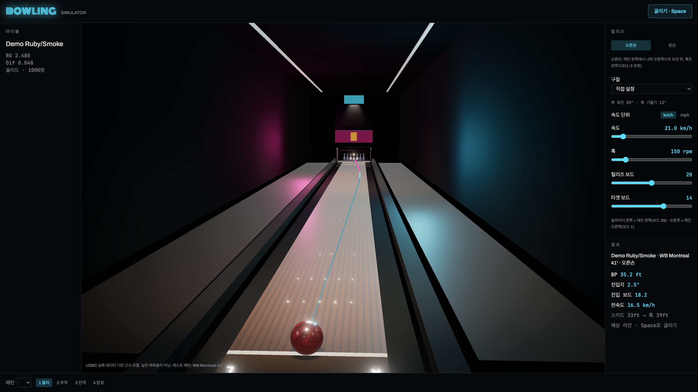

<div align="center">

# 🎳 Bowling Simulator

**USBC 실측 데이터로 맞춘 볼링 볼 모션 시뮬레이터**

오일 패턴 위에서 볼이 어떻게 미끄러지고, 꺾이고, 포켓에 들어가는지를 브라우저에서 굴려본다.

[](https://github.com/HDomi/bowling-simulator/actions/workflows/deploy.yml)


### [▶ 데모 굴려보기](https://hdomi.github.io/bowling-simulator/)

</div>



---

## 무엇인가

슬라이더로 구속·회전수·릴리즈 보드·타겟 보드를 잡고 굴리면, 궤적을 적분해서 브레이크포인트·진입각·진입 보드를 계산하고 3D로 재생한다. 핀에 닿는 순간부터는 Rapier 물리로 넘겨 핀이 실제로 넘어진다.

내 볼을 등록하면 RG·Diff·커버·그릿이 물리에 그대로 들어간다. 볼 안의 관성 타원체를 3D로 보고, 볼을 바꾸면 직전 볼의 궤적이 점선으로 남아 차이가 겹쳐 보인다.

숫자를 눈대중으로 정하지 않았다. **USBC Ball Motion Study Phase II**의 실측 범위에 들어오도록 마찰 파라미터를 맞췄고, 그 범위를 테스트로 못 박아 뒀다.

## 물리 모델

### 마찰

접지 마찰계수를 커버스톡·표면 그릿·Diff·오일량으로 계산한다.

```
μ_dry    = μ_cover × (Ra / 18)^0.35 × diffScale × 0.43
diffScale = max(0.55, 1 + 8 × (Diff − 0.048))
μ         = μ_floor + (μ_dry − μ_floor) × (1 − oil)^6   // μ_floor = 0.006
```

- **커버스톡** — 폴리 0.10 / 우레탄 0.16 / 펄 0.20 / 하이브리드 0.23 / 솔리드 0.26 / 파티클 0.28
- **그릿** — Ra(μ-in)로 환산 후 지수 0.35로 압축한다. 거칠수록 훅이 앞당겨진다
- **Diff** — 트랙 플레어를 만들어 덜 젖은 표면이 계속 레인에 닿게 하므로, 마른 구간에서 마찰이 얼마나 살아남는지를 좌우한다
- **오일** — 지수 6이라 오일이 조금만 있어도 마찰이 급격히 죽는다. 이게 스키드 구간을 만든다

마찰력은 **접촉점 미끄럼의 반대 방향**으로만 작용한다. 미끄럼이 `slipEpsilon` 아래로 떨어지면 구름 마찰로 넘어간다. 이 전환이 훅이 멈추고 롤 구간이 시작되는 지점이다.

궤적은 1/600초 고정 스텝으로 적분하고, 각속도는 접촉점 토크 `r × F`를 관성모멘트 `I = m·RG²`로 나눠 갱신한다.

### 구간 검출

USBC Figure 1과 같은 방식으로 스키드·훅·백엔드를 나눈다. CATS 센서 간격에 맞춰 2ft로 리샘플한 뒤, 앞에서부터 1차 회귀 R²가 0.99를 유지하는 최대 구간이 스키드, 뒤에서부터 같은 조건을 만족하는 최대 구간이 백엔드, 그 사이가 훅이다.

### 핀덱

궤적 적분은 핀에 닿기 전에 끝내고 Rapier로 상태를 넘긴다. 1번 핀 자리에 공을 생성하면 반지름 합보다 가까워 **핀에 파고든 채로 물리가 시작되고**, CCD는 이미 겹친 물체를 구제하지 못하기 때문이다.

핀 외형은 [USBC Equipment Specifications (2026년 3월), pp. 20–22](https://images.bowl.com/bowl/media/assets/usbc/equipment%20specs/26_231-26-march-es-manual.pdf)의 높이별 목표 지름을 통과하는 회전체다. 높이 15인치, 최대 지름 4.766인치, 바닥 평면 지름 2.031인치, 바닥 모서리 반경 5/32인치, 머리 원호 반경 1.273인치를 반영한다. 측정점 사이는 단조 3차 보간한다. 흰 코팅과 빨간 목띠 두 줄을 사용하며, 띠 위치·폭은 공식 치수가 아닌 외관 설정이다.

충돌체는 같은 단면을 여러 볼록 곡면 조각으로 나눠 목의 오목한 부분을 보존한다. 바닥 평면은 규격 지름의 얇은 원기둥으로 안정적으로 접촉시킨다. 질량은 합계 3 lb 8 oz로 맞추며 각 조각에 부피 비례로 분배한다. 실제 목재·코팅의 밀도 분포와 관성, 바닥 내부 구멍은 재현하지 않는 근사 모델이다.

핀덱은 1/240초 고정 스텝으로 밟는다. 프레임 시간을 그대로 쓰면 30 mph 진입에서 한 스텝에 핀 지름보다 멀리 움직여 뚫고 지나간다.

## 검증

`npm test` — 73개 통과.

| 지표 | USBC 실측 범위 | 검증 |
|---|---|---|
| 브레이크포인트 | 28.8 ~ 39.83 ft | ✅ |
| 49ft 속도 감소 | 1.31 ~ 2.53 mph | ✅ |
| 49ft 각도 변화 | 2.06 ~ 4.89° | ✅ |

기준 조건은 USBC 로봇 투구기 **Harry**(17 mph · 275 rpm · 축 회전 55° · 축 기울기 13° · PAP 5 × 3/8)와 WB Montreal 41' 패턴이다.

절대값은 근사지만 **단조성은 항상 지킨다.** 그릿을 거칠게 하면 훅이 앞당겨지고, 오일을 길게 하면 뒤로 밀리고, RG를 높이면 미끄럼이 더 남고, Diff를 높이면 진입각이 커진다. 전부 테스트로 고정돼 있다.

마이볼 체크포인트도 테스트로 고정했다. 같은 라인에서 500방과 4000방은 브레이크포인트가 4 ft 이상, 진입 보드가 5보드 이상 갈리고, 커버가 강해지는 순서(폴리 → 우레탄 → 펄 → 하이브리드 → 솔리드 → 파티클)대로 진입 보드가 왼쪽으로 밀린다. 무게를 12 lb로 내리면 Diff가 줄어 진입각이 작아진다.

핀덱 쪽은 터널링을 따로 잡는다. 진입 상태를 직접 만들어 넣는 12~28 mph × 0~6° × 16~20보드 조합과, 실제 시뮬 궤적을 그대로 넘기는 12~35 mph × 150~450 rpm 조합 양쪽에서 0핀이 한 번도 나오지 않아야 통과한다.

## 마이볼

RG·Diff·Int.Diff·커버스톡·그릿·핀-CG·레이아웃·색 두 개를 등록한다. 여러 개 저장하고 드롭다운으로 바꾼다. localStorage에만 저장하고 서버는 없다.

**스펙은 15 lb 기준 카탈로그 값이다.** 무게 슬라이더를 돌리면 제조사 무게별 표를 일반화한 근사로 RG·Diff가 바뀐다. 14~16 lb는 같은 코어라 거의 같고, 12~13 lb는 코어가 줄어 Diff가 빠르게 떨어지고, 11 lb 이하는 제네릭 코어라 Diff가 0.002~0.004로 뭉개져 타원체가 구가 된다. 시뮬레이션은 이 환산값을 쓴다.

**관성 타원체**는 RG 세 축(핀 축 최소 · MB 축 최대 · 중간 축)에서 반축을 `(RG평균 / RG축)^E`로 잡는다. 실제 차이가 2% 수준이라 기본 과장 E = 10이고, 옆에 실제 비율을 병기한다. E = 1이면 실제 비율이다.

표면에는 핀·CG·MB(비대칭만)를 찍고, 듀얼 앵글 레이아웃(드릴각 · 핀-PAP · VAL각)을 넣으면 PAP와 그립 홀 세 개를 구면 위 호 이동으로 잡아 그린다. 지공 기하를 단순화한 시각화용 근사다.

USBC 장비 규정(RG 2.46~2.80, Diff ≤ 0.060, Int.Diff ≤ 0.030)을 벗어나면 경고만 띄우고 저장은 막지 않는다. 규정 밖 볼도 굴려볼 수 있어야 한다.

## 오일 패턴

`WB Montreal 41'`은 그림으로 그린 게 아니라 **Kegel 오일 머신의 T.OIL 패스 목록에서 격자를 재구성**한다. 전진 10패스 + 역방향 3패스를 보드별 μL로 적층해서 41ft · 26.89 mL · 3.1:1을 만든다.

나머지는 하우스샷 형태의 숏 35 / 미디엄 40 / 롱 45다. 다운레인 감쇠는 USBC 실측 분포(8ft 30 units, 32ft 8, 47ft 5)에 맞췄다.

## 릴리즈 스타일

공개 자료(bowling.com 볼러 타입, bowlingball.com BowlVersity, Spectre 볼러 프로필)의 스타일별 구간에서 중앙값을 뽑았다.

| 스타일 | 회전수 | 구속 | 축 회전 / 기울기 |
|---|---|---|---|
| 스트레이트 (입문) | 150 rpm | 20.9 km/h | 10° / 5° |
| 스트로커 | 240 rpm | 27.4 km/h | 45° / 15° |
| USBC 로봇 (Harry) | 275 rpm | 27.4 km/h | 55° / 13° |
| 스피너 (헬리콥터) | 280 rpm | 24.9 km/h | 85° / 70° |
| 트위너 | 330 rpm | 26.6 km/h | 60° / 20° |
| 파워 스트로커 | 360 rpm | 25.7 km/h | 65° / 22° |
| 크랭커 | 440 rpm | 24.9 km/h | 75° / 25° |
| 덤리스 | 480 rpm | 26.6 km/h | 75° / 12° |
| 투핸드 | 550 rpm | 29.8 km/h | 80° / 10° |

## 조작

| 키 | 동작 |
|---|---|
| `Space` | 굴리기 |
| `1` `2` `3` `4` | 카메라 — 볼러 / 추적 / 핀덱 / 탑뷰 |
| `Esc` | 볼 편집 폼 · 모바일 마이볼 시트 닫기 |
| 드래그 · 휠 | 시점 회전 · 줌 (볼 뷰어도 같다) |

입력 폼에 포커스가 있으면 단축키를 먹지 않는다. 모바일은 상단 볼 이름 버튼으로 마이볼 시트를 연다.

보드 번호는 USBC 관례를 따른다. **1번이 오른쪽 거터 옆, 39번이 왼쪽 거터 옆**이고, 슬라이더 방향은 화면의 좌우와 일치한다. 오른손은 레인 왼쪽에서 나와 오른쪽으로 보낸 뒤 훅이 왼쪽으로 걸려 1-3 포켓에 들어간다.

구속 단위는 표시만 바꾼다. 계산은 항상 mph로 하고(USBC 기준값이 mph), 국내 볼링장 전광판 관례에 맞춰 기본 표시를 km/h로 둔다.

## 구조

```
src/
├── domain/              # 순수 로직. Three.js를 모른다
│   ├── constants.ts     # 레인·핀·볼 실측 규격, 물리 파라미터
│   ├── ball.ts          # 볼 검증, USBC 규정 경고, 무게별 스펙 환산
│   ├── ballGeometry.ts  # RG 축, 관성 타원체, 핀·CG·MB·그립홀 구면 기하
│   ├── ballStorage.ts   # localStorage 직렬화·정리
│   ├── physics/
│   │   ├── friction.ts  # μ 계산, 오일 이중선형 보간, 보드↔좌표
│   │   ├── simulate.ts  # 궤적 적분, 브레이크포인트·진입각
│   │   └── phases.ts    # R² 0.99 구간 분할
│   ├── patterns/        # Kegel 패스 → 오일 격자 재구성
│   ├── pins/layout.ts   # 10핀 배치, 스트라이크 판정
│   └── styles.ts        # 릴리즈 스타일 프리셋
├── scene/               # Three.js 렌더링
│   ├── BowlingScene.ts  # 씬·카메라·재생 루프, 비교용 고스트 궤적
│   ├── BallViewer.ts    # 마이볼 3D 뷰어 (타원체·축·마커·그립홀)
│   ├── PinDeckPhysics.ts # Rapier 핀 충돌
│   ├── coords.ts        # 물리 좌표 → Three.js 좌표
│   ├── createBallMesh.ts # 커버·그릿별 질감 텍스처
│   └── create*.ts       # 레인·핀·조명·배경 메시
├── stores/
│   ├── simulator.ts     # 릴리즈·패턴·결과
│   └── balls.ts         # 마이볼 목록·활성·비교, localStorage 동기화
└── components/          # Vue UI (BallPanel · BallEditor · BallViewerCanvas …)
```

`domain`은 Three.js에 의존하지 않는다. 그래서 물리 테스트가 헤드리스로 돈다.

## 개발

```bash
npm install
npm run dev        # http://localhost:5173
npm test           # Vitest 73개
npm run build      # 타입 체크 + 프로덕션 빌드
npm run preview    # 빌드 결과를 배포 경로로 확인
```

## 배포

`main`에 푸시하면 [GitHub Actions](.github/workflows/deploy.yml)가 테스트 → 빌드 → GitHub Pages 게시까지 처리한다.

프로젝트 페이지라 `/bowling-simulator/` 하위에 올라가므로 Vite `base`를 빌드와 preview에서만 하위 경로로 바꾼다. 개발 서버는 루트를 쓴다.

> 처음 한 번은 리포지터리 **Settings → Pages**에서 Source를 **GitHub Actions**로 바꿔줘야 한다.

## 스택

Vue 3 · TypeScript · Vite · Pinia · Three.js · Rapier3D · Tailwind CSS 4 · Vitest

---

> [!NOTE]
> USBC 실측 데이터를 기반으로 한 **근사 모델**이다. 실전 레인 리딩이나 볼 선택을 예측하는 용도가 아니다.
> 파라미터 절대값은 튜닝 대상이고, 보장하는 것은 실측 범위 안에 든다는 점과 물리적 단조성뿐이다.
